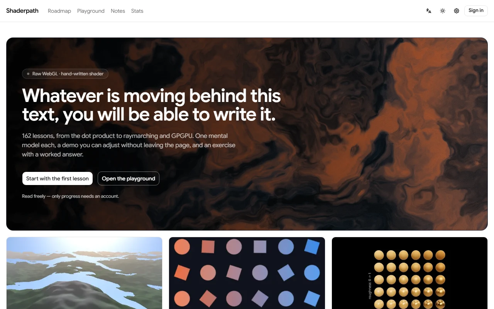
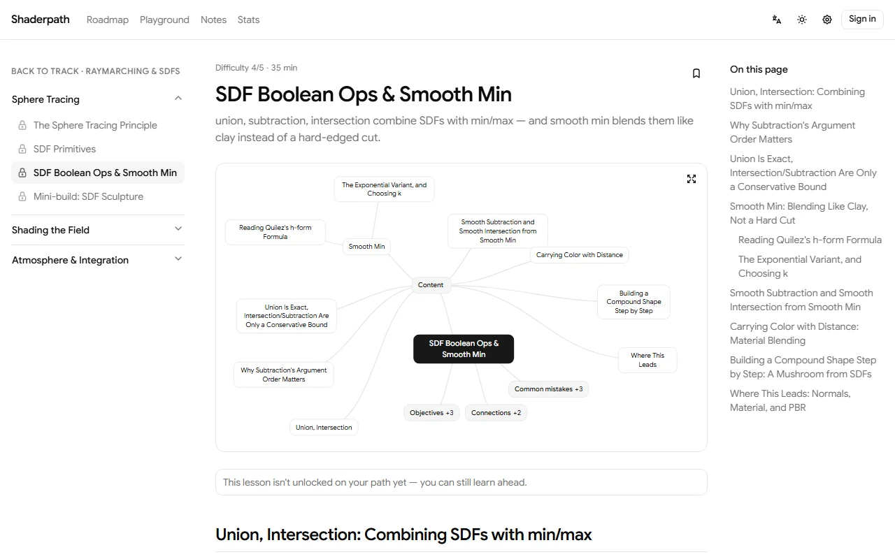
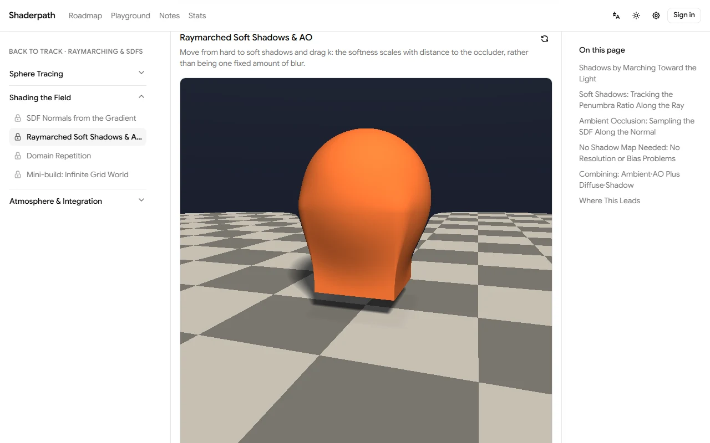
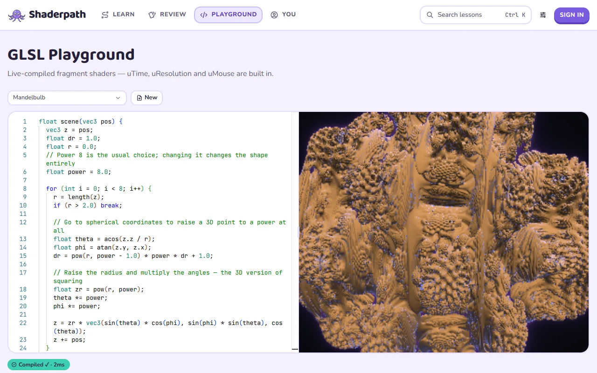
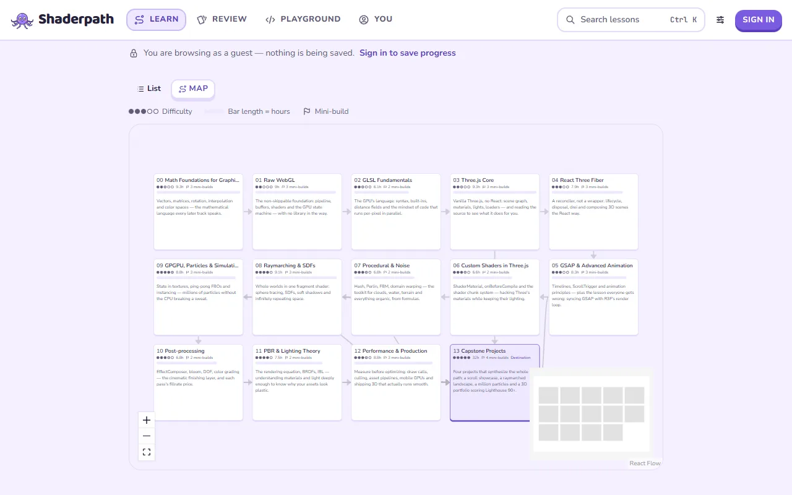

<div align="center">

# Shaderpath

**Learn Three.js, WebGL and GLSL — from the dot product to raymarching — by writing every piece yourself.**

[](https://shaderpath.drisdev.io)
[](https://github.com/dris1153/shaderpath/releases)
[](LICENSE)
[](https://shaderpath.drisdev.io/en/roadmap)
<br>
[](https://nextjs.org)
[](https://react.dev)
[](https://threejs.org)
[](https://www.typescriptlang.org)
[](https://supabase.com)

[**Open the site**](https://shaderpath.drisdev.io) · [Roadmap](https://shaderpath.drisdev.io/en/roadmap) · [Playground](https://shaderpath.drisdev.io/en/playground) · [Releases](https://github.com/dris1153/shaderpath/releases)

<picture>
  <source media="(prefers-color-scheme: dark)" srcset=".github/assets/home-dark.webp">
  
</picture>

</div>

Shaderpath is a bilingual (English / Vietnamese) course for real-time graphics on the web. It runs from vectors and matrices, through raw WebGL, GLSL, Three.js and React Three Fiber, up to raymarching, GPGPU simulation, post-processing, PBR and production performance. Every lesson teaches one mental model and lets you change it live on the page. You can read everything without an account. Sign in only to save progress, notes and your review schedule.

## Screenshots

<table>
  <tr>
    <td width="50%">
      <picture>
        <source media="(prefers-color-scheme: dark)" srcset=".github/assets/lesson-dark.webp">
        
      </picture>
      <p align="center"><b>Lessons</b> — one mental model each, with a mind map, objectives and common mistakes</p>
    </td>
    <td width="50%">
      <picture>
        <source media="(prefers-color-scheme: dark)" srcset=".github/assets/demo-dark.webp">
        
      </picture>
      <p align="center"><b>Live demos</b> — adjust the parameter the lesson is about and watch it change</p>
    </td>
  </tr>
  <tr>
    <td width="50%">
      <picture>
        <source media="(prefers-color-scheme: dark)" srcset=".github/assets/playground-dark.webp">
        
      </picture>
      <p align="center"><b>GLSL playground</b> — Monaco editor, live WebGL2 preview, 35 presets</p>
    </td>
    <td width="50%">
      <picture>
        <source media="(prefers-color-scheme: dark)" srcset=".github/assets/roadmap-dark.webp">
        
      </picture>
      <p align="center"><b>Roadmap</b> — 14 tracks as a map, with your progress on it</p>
    </td>
  </tr>
</table>

## What's inside

- **162 lessons in 14 tracks, about 136 hours.** Each lesson covers one idea in 20–45 minutes. Modules end in mini-build checkpoints, and the course ends with four capstone projects.
- **124 live demos.** They are built with raw WebGL2, Three.js or React Three Fiber, and their controls change exactly the thing the lesson explains.
- **Exercises with worked answers.** Concept questions, TypeScript tasks and shader tasks, each with hints, a checklist and a written solution.
- **Spaced-repetition review.** Recall cards for 123 theory lessons, scheduled with an SM-2-style algorithm from the grades you give yourself.
- **GLSL playground.** A Monaco editor with GLSL highlighting, a live WebGL2 preview, exact error lines, 35 presets and saved snippets.
- **Notes, bookmarks and search.** Notes are anchored to headings, and <kbd>Ctrl</kbd>+<kbd>K</kbd> searches every lesson in the language you're reading.
- **Stats.** Streaks, a 26-week activity heatmap and time spent per track.
- **Adaptive quality.** Demos detect a quality tier and cap the canvas DPR and effects to match. A manual choice in Settings always wins.
- **Your data stays yours.** Progress exports to versioned JSON and imports back with a preview. Replace and merge both run in a single transaction.

## Curriculum

| # | Track | Lessons | Time |
|---:|---|---:|---:|
| 00 | Math Foundations for Graphics | 14 | 9.3 h |
| 01 | Raw WebGL | 15 | 9.0 h |
| 02 | GLSL Fundamentals | 10 | 6.1 h |
| 03 | Three.js Core | 14 | 9.3 h |
| 04 | React Three Fiber | 13 | 7.9 h |
| 05 | GSAP & Advanced Animation | 13 | 8.3 h |
| 06 | Custom Shaders in Three.js | 10 | 6.6 h |
| 07 | Procedural & Noise | 10 | 6.8 h |
| 08 | Raymarching & SDFs | 13 | 9.1 h |
| 09 | GPGPU, Particles & Simulation | 12 | 8.8 h |
| 10 | Post-processing | 10 | 6.8 h |
| 11 | PBR & Lighting Theory | 11 | 7.5 h |
| 12 | Performance & Production | 13 | 8.8 h |
| 13 | Capstone Projects | 4 | 32 h |

## Tech stack

| Area | Tools |
|---|---|
| App | Next.js 16 (App Router, Turbopack), React 19, TypeScript, next-intl |
| UI | Tailwind CSS v4, shadcn/ui (Base UI), Google Sans |
| Graphics | three.js r185, React Three Fiber 9, drei, @react-three/postprocessing, GSAP 3, raw WebGL2 |
| Content | MDX, KaTeX, Shiki, a typed content registry generated at build time |
| Editor | Monaco with a custom GLSL tokenizer |
| Data | Postgres on Supabase (Auth + row-level security), Drizzle ORM |
| State | Zustand, TanStack Query |
| Tests | Vitest, Playwright, axe |

## Getting started

Requirements:

- Node.js 20+ and pnpm (the version is pinned in `packageManager`, so `corepack enable` picks it up)
- A Postgres database (Supabase in production)
- Docker, only to run the test suites, which start a throwaway Postgres

```bash
pnpm install
cp .env.example .env.local   # fill in DATABASE_URL, DIRECT_URL and the Supabase keys
pnpm db:migrate              # creates the schema
pnpm dev                     # http://localhost:3000
```

Migrations do not run on boot. The app is deployed to serverless functions, where a boot hook fires on every cold start, and DDL does not belong on the request path.

Production build:

```bash
pnpm build      # regenerates the lesson registry and search index, then next build
pnpm start
```

## Database & migrations

- `DATABASE_URL` is the runtime connection. On Supabase, use the **transaction pooler** (port 6543). Each serverless function opens its own connection, so the direct connection runs out under light traffic. `db/client.ts` detects `:6543` and switches to a single connection with prepared statements off, which that pooler requires.
- `DIRECT_URL` (port 5432) is used only by `pnpm db:migrate`. Running DDL through the transaction pooler is not safe.
- Migrations live in `db/migrations/`. After changing `db/schema.ts`, generate them with `pnpm db:generate` and apply them with `pnpm db:migrate`.
- The database holds progress, notes, bookmarks, review scheduling and settings, never lesson content. Every table is protected by row-level security. `pnpm verify:rls` checks the policies against the live database.

## Deploy (Vercel + Supabase)

1. Create a Supabase project and copy both connection strings from _Project Settings → Database → Connection string_.
2. In Vercel _Settings → Environment Variables_, set `DATABASE_URL` to the transaction-pooler URL (port 6543), plus `NEXT_PUBLIC_SUPABASE_URL` and `NEXT_PUBLIC_SUPABASE_ANON_KEY`. Set `DIRECT_URL` there only if you migrate from CI.
3. Apply the schema once from your machine: `DIRECT_URL=... pnpm db:migrate`
4. In Supabase _Authentication → URL Configuration_, set the Site URL and redirect URLs to your domain.
5. Deploy. Re-run step 3 whenever a migration is added, because the app will not create tables for you.

## Backup & restore

1. **In the app (recommended):** go to _Settings → Data_. _Export_ downloads `shaderpath-progress-<date>.json`, tagged with a schema version. _Import_ validates the file, previews the row counts and downloads a backup of your current state first. It then replaces or merges your data in one transaction.
2. **On the database side:** use Supabase's own backups, or run `pg_dump` against `DIRECT_URL`.

Imports with a mismatched `schemaVersion` are rejected outright. Re-export from the same app version instead of editing the JSON by hand.

## Content authoring

- `content/tracks/*.ts` holds the track, module and lesson metadata. Slugs are frozen, because renaming one breaks notes and bookmarks.
- Each lesson lives in `content/lessons/<track>/<slug>/`:
  - `theory.en.mdx` and `theory.vi.mdx`
  - `references.ts`, `exercises.ts` and `review-cards.ts`
  - `demo.tsx`, with any sibling `.vert` and `.frag` files
- Run `pnpm gen:registry` to regenerate the typed registry after adding files.
- `pnpm lint:content` is the quality gate. It checks heading parity between the two languages, citations, exercise and review-card rules, and KaTeX glyph safety.
- Figures are authored as English SVG. `pnpm gen:figures` renders the Vietnamese copies from `content/figures-i18n/`, and `pnpm lint:figures` fails if a copy drifts from its source.

## Checks

```bash
pnpm typecheck        # tsc --noEmit
pnpm lint             # eslint
pnpm test             # vitest (starts a throwaway Postgres in Docker)
pnpm test:e2e         # playwright (boots its own server on :3100, with a fresh database per run)
pnpm audit:guards     # no custom CSS, strict TS, full content and figure lint
```

## License

The source code is released under the [MIT License](LICENSE). The educational content is © 2026 dris1153, all rights reserved. That covers the lesson text, exercises, review cards, mind maps and figures. See [LICENSE](LICENSE) for exactly which files are included.
